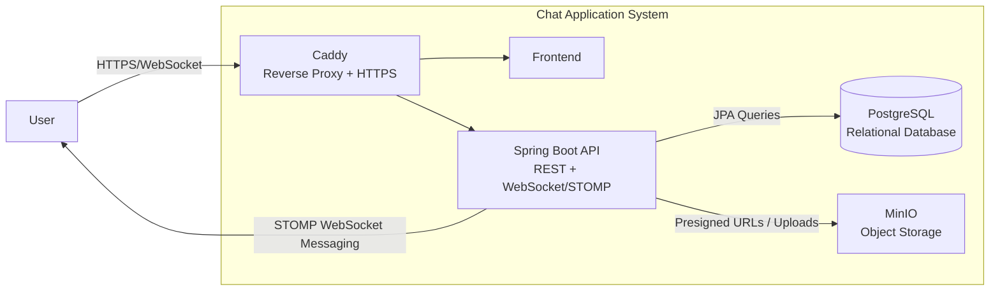

# Slackr
Real time chat app.

Hosted at: [Slackr](https://slackr.minhn.me/)

## Features
- Slack-style real-time chat with channels and threaded conversations
- Emoji reactions, message pinning, editing, and deletion
- Private and public channels with membership-based access control
- Real-time messaging using WebSocket-based STOMP protocol
- Image upload support with preview via object storage
- Stateless authentication using JWT with secure password hashing (BCrypt)
- Role- and membership-aware authorization for channel access
- Live UI updates across message events (send, edit, delete, react, pin)
- No framework SPA frontend served statically

## Architecture


## Tech stack

### Frontend

- Vanilla JavaScript (no framework)
- HTML5 / CSS3
- Express.js (static file server + runtime env injection)

### Backend

- Java 26
- Spring Boot
- Spring Security (JWT authentication)
- Spring WebSocket (STOMP protocol)
- Spring Data JPA
- JUnit + MockMvc (testing)

### Database

- PostgreSQL
- MinIO (S3-compatible storage for image uploads)

### Infrastructure

- Docker / Docker Compose
- Caddy reverse proxy (HTTPS)
- Vultr VPS
- GitHub Actions CI/CD

## Deployment
```sh
git clone git@github.com:Minh7080/uniwatch.git
cd Uniwatch

docker compose up --build
```
Ensure to fill in the environment variables in of all files in `Uniwatch/env/` directory before running `docker compose up --build`
